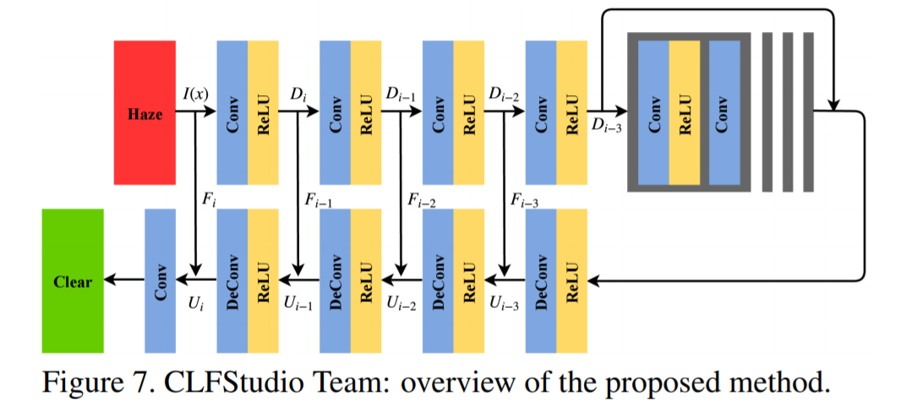

# PFFNet
Our solution for NTIRE2018 Image Dehazing Challenge (20.549db for Indoor and 20.230db for Outdoor), final results could be refer at [NTIRE2018](http://www.kfm.cat/pdf/ntire-2018-dehazing-challenge-report.pdf). Futher version is accepted by ACCV2018 https://arxiv.org/pdf/1810.02283.pdf.



## Preparation
Using data_argument to enchance the datasets, it will produce below datasets
```bash
$ python dara_argument.py --fold_A=IndoorTrainHzay --fold_B=IndoorTrainGT --fold_AB=IndoorTrain 

IndoorTrain
    \data   hazy image
    \label  clear image
```

## Train
Using default parameter to train
```bash
python train.py --cuda --gpus=4 --train=/path/to/train --test=/path/to/test --lr=0.0001 --step=1000
```

## Test
```bash
python test.py --cuda --checkpoints=/path/to/checkpoint --test=/path/to/testimages
```

## Citation
If you use the code in this repository, please cite our paper:

```
@inproceedings{mei2018pffn,
  title={Progressive Feature Fusion Network for Realistic Image Dehazing},
  author={Mei, Kangfu and Jiang, Aiwen and Li, Juncheng and  Wang, Mingwen},
  booktitle={Asian Conference on Computer Vision (ACCV)},
  year={2018}
}
```
